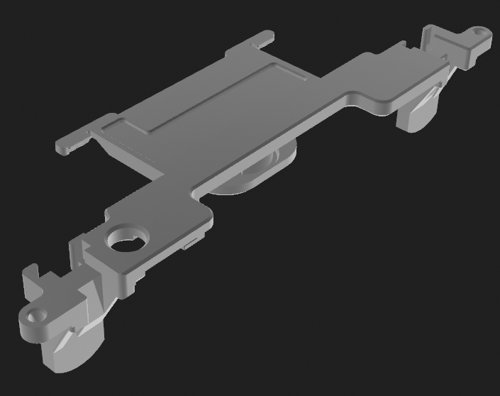
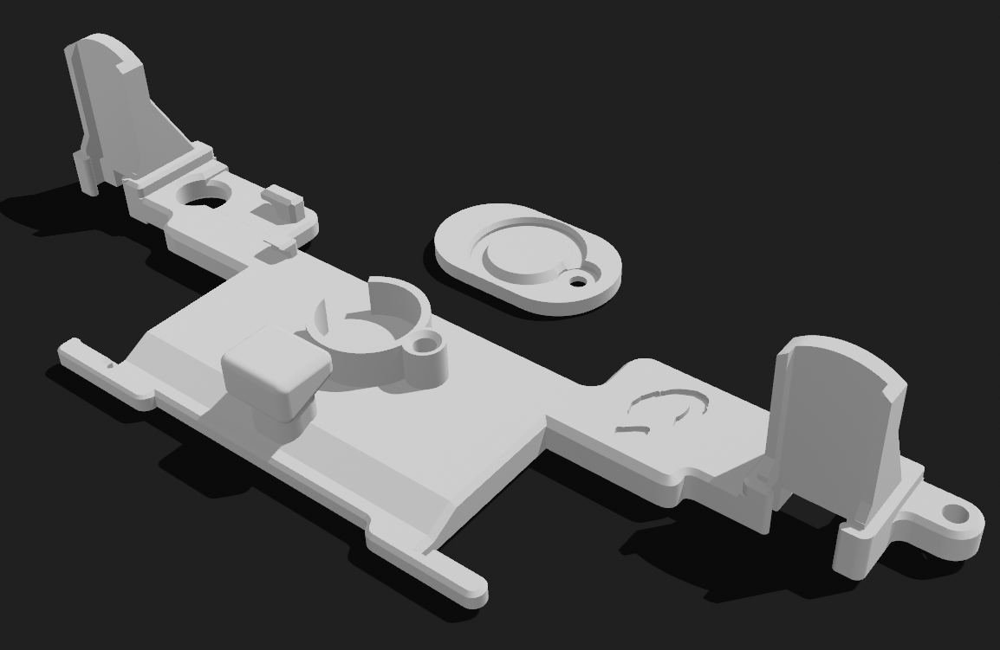

## Ube-s-Phob-Bracket

# An open source Bracket for the Phob GCC with...
 - Mouse click L/R compatibility 
 - L-cut hole for phob 1.2X teensy pins
 - Cell rumble mount with Lid
 - Made for easy printing on FDM printers
 - Open Source! just throw me some credit @abeartus :)
 
# required parts
 - M1.6 Heat inserts
     - https://www.mcmaster.com/92120A150/
     - heat inserted with soldering gun on low to the 3 holes on the rumble bracket

 - M1.6 Screw 
     - https://www.mcmaster.com/90910A901/
     - screws into the inserts for the rumble cap and to secure the MB

# similar guide
 - guide by fires on his bracket, mines is pretty much the same so credit to fires 
    - https://firescc.com/mod-guides#/rumble-bracket

# Images

